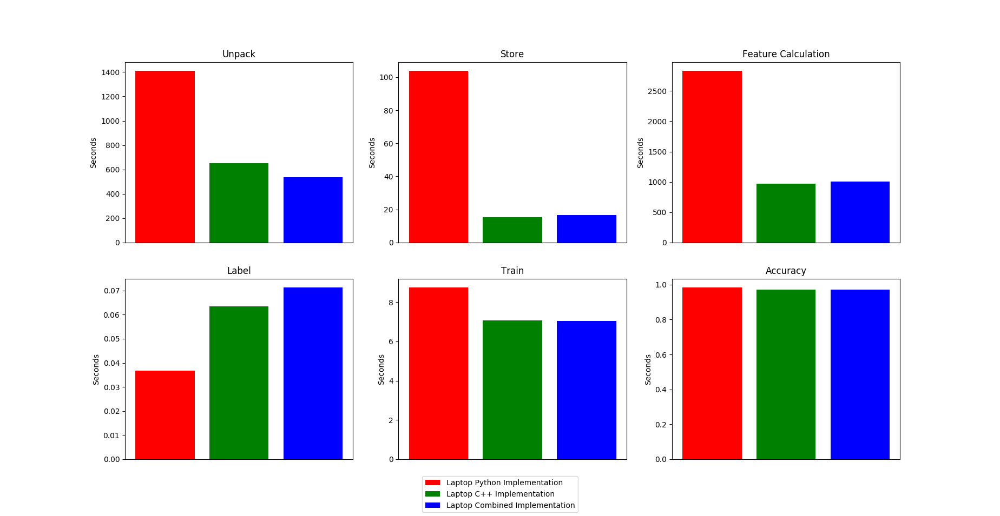
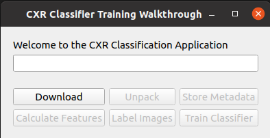
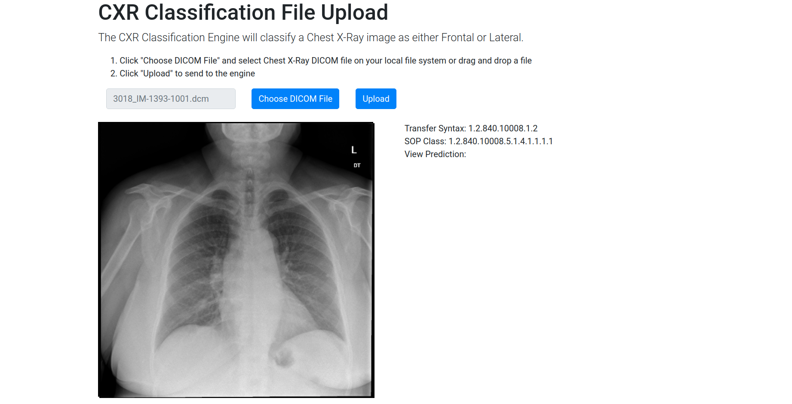

# Chest X-ray Image View Classification
The heart of this project is an image classifier based on [this paper](https://www.researchgate.net/publication/283778178_Chest_X-ray_Image_View_Classification) that can determine whether a Chest X-ray is a frontal or lateral view orientation. Additionally, there are a bunch of other technologies built around this core algorithm to facilitate use of the classifier. 

The project can be split into 2 parts: a desktop application for training the algorithm and a deployable web API with an accompanying web UI for utilizing the trained algorithm. 

The desktop app is a Qt GUI application that guides the user through the training steps including: downloading the image set, unpacking it, storing the metadata, extracting the features, data labaling, cross-validation, and classifier training. The application is optimally coded in C++, Python, and a combined Python/C++ solution. All implementations come with full logging and the Python implementation is equipped with a suite of pytest unit tests. 

The web API contains the trained model and accepts DICOM files to classify as either frontal or lateral and can be deployed either to the local machine, a local VM, or to AWS Elastic Beanstalk. The web API can be easily used with the complementary web UI. 

## Motivation
The inspiration for this project arises from my experience in the medical imaging industry. A classifier such as this would be useful in industry. One use case being a lot of medical imaging software relies on DICOM tags such as laterality (0020,0060), view position (0018,5101), and patient orientation (0020,0020) to perform some action. However, this tag is not always there or has values of all images in the study or series as seen in the image set from [NLM History of Medicine](https://openi.nlm.nih.gov/faq#collection), which is the image set used in the cited paper. Thus, this automatic classifier can be used to label all of these images so that the medical software relying on these DICOM tags can perform their duty.
 
The main purpose of this project was to learn about a wide range of technologies and concepts and how to integrate them into one large project. Using this paper's algorithm as the core of the project, I utilized the following technologies and concepts to build the application and web API:
 - PostgreSQL (Python package: psycopg2, C++ library: libpqxx) to organize the metadata, features, and labels of all of the downloaded images
 - Qt for building multi-threaded
 - NumPy for most calculations in Python
 - Pydicom Python library and DCMTK C++ library for working with DICOM files
 - Flask for designing the web API and web app
 - Amazon Web Services (AWS) Elastic Beanstalk for deploying the Flask app to the cloud
 - Gunicorn and Nginx to securely deploy the Flask app web API to a local virtual machine
 - OpenCV for image processing in both Python and C++
 - pytest for writing an automated suite of unit tests
 - Boost for configuration file handling in C++
 - Armadillo for matrix operations in C++
 - mlpack for dataset manipulation and machine learning in C++
 - Object-Oriented Concepts: Inheritance (including multiple), Encapsulation, Polymorphism, Abstraction, Coupling & Cohesion
 - ctypes Python library for wrapping C++ functionality
 - UML class diagram for modeling system
 - PyInstaller for building Python implementation into an executable
 - g++, Make, QMake, and CMake build tools for building C++ executables and shared libraries
 - VMware Workstation for testing on local virtual machines
 - Proper logging using Python's built-in logging library and spdlog C++ library
 - Git: Large File Storage, Submodules
 - Python packaging and deployment to PyPI
 - Multi-threading using QThreadPool and the standard thread library
 - Downloading dataset: Qt for C++ and requests library for Python
 - Github Issues for bug and task tracking
 - Jenkins for CI/CD
 - Shell scripting (Bash)
 - HTML, CSS, JavaScript for web UI using bootstrap, cornerstone, and AJAX technologies

## Data
As stated, I used the same data set that was in the paper ([NLM Image Set](https://openi.nlm.nih.gov/faq#collection)). This consists of 7470 chest X-ray images (CR) in the form of DICOM images. To organize the image set, I stored the metadata from the DICOM images into a PostgreSQL database using my [DicomToDatabase repository](https://github.com/Matt-Conrad/DicomToDatabase) I made. 

While the training app can handle processing of all 7470 images, I also provide a subset (10 images) of the dataset in the *NLMCXR_subset_dataset.tgz* to test the app and to make it quicker to go through the steps of the app. The model trained with all 7470 images using the app is also included as *full_set_classifier.joblib*. Altogether, the entire NLM image set is 117.4GB unpacked and 80.7GB packed, so the subset is preferrable. Currently the code is set up to operate with the subset. If you would like to switch to the full image set, you must go into the *config.ini* file and set ```dataset=full_set``` in the *dataset_info* section.

## Performance
Using the horizontal and vertical profile method from the paper, I am able to get an accuracy of 98.4% while using 2/3 of the NLM image set as the training set with 10-fold cross-validation, which is the same reported in the paper. Additionally, I am able to get the 90% accuracy when using the body-size ratio method, however I do not use it at the core of this application as it is a much lower accuracy. For the profile method, I also get a 98.4% with the test set.



As one would expect, the C++ implementation is faster than the Python approach, and the Combined implementation performs on par with the C++ one. This Combined approach has the best of both worlds: the quick development of Python code and the speedy execution of C++ for performance critical areas. This exercise is a testament that using both Python and C++ in development is an impactful combination.   

## Testing
The suite of unit tests were created using Pytest and can be found in Python > DesktopApp > test. These tests mainly cover the backend functionality of the app such as downloading and feature calculation. To run the tests, the pip environment must be set up (see section *Using source code* on how to set that up). Once done, all you have to do is run ```pytest .``` from the test folder.

Workflow testing of the app and executables was done on the following environments:
   - Windows 10 laptop with Intel i7-4700MQ CPU and NVIDIA GeForce GT 755M GPU (Only source code testing done)
   - Fresh Ubuntu 18.04 virtual machine using VMware Workstation Player 15 on top of an Ubuntu 18.04 Desktop with AMD Ryzen 2600 CPU and NVIDIA RTX 2070 Super GPU
   - AWS Elastic Beanstalk web server on a Python 3.6 platform running on 64-bit Amazon Linux
   - Fresh Ubuntu 20.04 virtual machine using VMware Workstation Player 16 on top of an Ubuntu 20.04 Laptop with AMD 3rd Generation Ryzen 9 4900HS and NVIDIA GeForce RTX 2060 Max-Q

## Desktop App Usage


Since there are 3 implementations of the app, there are many ways to build and run it:
- Python implementation
   1. Run source code
   2. Run pre-built file-based executable
   3. Run pre-built folder-based executable
   4. Build and run file-based executable
   5. Build and run folder-based executable
- C++ implementation
   1. Run pre-built executable
   2. Build using QMake and run the resulting executable
- Combined implementation
   1. Run Python source code with pre-built C++ shared libraries
   2. Build C++ side using individual g++ commands and run Python source code
   3. Build C++ side using provided Makefile and run Python source code
   4. Build C++ side using CMake and run Python source code

NOTE: Pre-built executables and shared libraries are compiled on Ubuntu 20.04 so they may only work on that OS. Additionally, scripts for building are targeted toward Ubuntu/Linux users.

 ### For all paths
 1. Clone the git repository onto your computer: 
    ```
    git clone https://github.com/Matt-Conrad/CXR_View_Classification.git
    ```
 2. Set up Postgres if you don't already have it by running postgresSetup.sh: ```postgresSetup.sh```
 2. (OPTIONAL) Change the default configuration if you wish. 
      - The *postgresql* section contains the server host and port, desired name of the DB to be created, as well as user and password. The template is currently set up to create a DB named "db" on the localhost, so you can leave it as is or rename it if you wish. 
      - Leave the *dicom_folder* section alone as it gets filled in automatically as the app goes through the steps. You can also rename the tables that will be created.
      - You can leave the *table_info* section alone, or if you want to change the names of the tables you can here
      - Feel free to leave the *logging* section alone. For more detail, go down to the *Logging* section of this README
      - Currently the code is set up to operate with the subset. If you would like to switch to the full image set, you must change the *dataset_info* section to either be "full_set" or "subset"

 ### Python
 Here are the steps for using the app for the various paths.

 #### Running from source and building 
 1. Run pythonSetup.sh file to set up Python: ```pythonSetup.sh [arg]```
   - ```pythonSetup.sh source``` if you're going to run from source
   - ```pythonSetup.sh build``` if you're going to build the file-based or folder-based executable
 2. Activate the virtualenv: ```source CXR_env/bin/activate```
 3. (Optional) If you're going to build the executable, run ```pyinstaller [arg]``` in *CXR_View_Classification/Python/pyinstaller*
   - ```pyinstaller folder.spec``` if building folder-based executable
   - ```pyinstaller one_file.spec``` if building file-based executable
 4. Run the program:
   - ```python main.py``` in *CXR_View_Classification/Python/DesktopApp* if you're running from source
   - ```./CXR_Classify``` *CXR_View_Classification/Python/builds/dist_folder* executable for folder-based approach
   - ```./CXR_Classify``` *CXR_View_Classification/Python/builds/dist_one_file* executable for file-based approach

 #### Run pre-built folder-based and file-based executables
 1. Download and unzip the *FOLDER_NAME.zip* from the Github release
 2. Execute the *CXR_Classify* executable in *FOLDER_NAME* folder
   - Where FOLDER_NAME is *dist_folder* if using the folder-based executable and *dist_one_file* if using the file-based executable

 ### C++ Implementation

 #### Run pre-built executable
 1. Run the cppSetup.sh script to set up C++ libraries: ```cppSetup.sh prebuilt```
 2. Download the *cppBuild.zip* folder from the Github release and unzip it.
 3. Execute the provided executable and go through the steps.

 #### Build using QMake and run the resulting executable
 1. Run cppSetup.sh to set up C++ libraries: ```cppSetup.sh build```
 2. Build executable using qmake:
   - Create and change to build directory: cd ```mkdir CXR_View_Classification/Cpp/build && cd CXR_View_Classification/Cpp/build```
   - Create build system using qmake: ```qmake ../CXR_classify/CXR_classify.pro CONFIG+=debug```
   - Build the executable: ```make```
 3. Execute the *CXR_View_Classification/Cpp/build/CXR_classify* executable and go through the steps.

 ### Combined Implementation
 The source code for this implementation can be found in *CXR_View_Classification/Combined/DesktopApp/src*. Along with the source code, there is also a Makefile and a CMakeList.txt file in there to aid building the executables. There are 3 equivalent ways to build this code: g++ commands, Make, and CMake. 
 1. From the miscellaneous folder, run the build script with the desired argument to set up and build the shared libraries: ```combinedBuild.sh [arg]```
   - ```combinedBuild.sh download``` if you're going to download the shared libraries
   - ```combinedBuild.sh g++``` if you're going to build using the g++ method
   - ```combinedBuild.sh make``` if you're going to build using the Make method
   - ```combinedBuild.sh cmake``` if you're going to build using the CMake method
 2. (Optional) If you're going the download route, then download the *combinedSharedLibraries.zip* folder from the Github release and unzip it.
 3. Activate the virtualenv: ```source CXR_env/bin/activate```
 4. (Optional) If you're doing the download route, add the Qt lib to LD_LIBRARY_PATH so program can find Qt shared: ```export LD_LIBRARY_PATH="/PATH/TO/CXR_env/lib/python3.6/site-packages/PyQt5/Qt/lib:$PATH"```
 5. Run the app using Python: ```cd CXR_View_Classification/Combined/DesktopApp && python main.py```


## Web API/UI Usage for local machine or local VM


There are several ways to deploy the web interfaces: standalone built-in Flask server, standalone Gunicorn server running the Flask app, and an Nginx/Gunicorn server pair where the Nginx server works as a reverse proxy for the Gunicorn server running Flask (recommended). Below I discuss the preparation required for each path, then I provide the following instructions

Here are the steps for deploying the model from the source code:
 1. Clone the git repository onto your computer: 
    ```
    git clone https://github.com/Matt-Conrad/CXR_View_Classification.git
    ```
 2. Start the desired server configuration by running: ```engineSetup.sh SERVER_TYPE SERVER_ACCESS``` where:
   - SERVER_TYPE is the type of server you want to set up. 
      - ```flask``` if you're trying to do the standalone Flask server
      - ```gunicorn``` if you're trying to do the standalone Gunicorn server running the Flask app
      - ```nginx``` if you're trying to do the Nginx/Gunicorn server pair
   - SERVER_ACCESS is the type of access for the server
      - ```localhost``` if you only want the server to be accessible by the machine it's running on
      - ```network``` if you want the server to be accessible by any machine on the network
 3. You now have a running server or server pair. Use the send_script.py script to send a DCM file over HTTP to the endpoint: ```python send_script.py IP_ADDRESS:PORT```. Make sure you have all or at least part of the *NLMCXR_dcm* folder in *CXR_View_Classification/datasets*.
   - ```IP_ADDRESS``` equals:
      - ```127.0.0.1``` if ```localhost``` was specified in step 2
      - Server's IP address if ```network``` was specified in step 2
   - ```PORT``` equals:
      - ```5000``` if ```flask``` was specified in step 2
      - ```8000``` if ```gunicorn``` was specified in step 2
      - ```80``` if ```nginx``` was specified in step 2

## Web API/UI Usage for AWS Elastic Beanstalk
 1. Clone the git repository onto your computer: 
    ```
    git clone https://github.com/Matt-Conrad/CXR_View_Classification.git
    ```
 2. Go to an AWS Elastic Beanstalk console > "Environments" Tab
 3. Click "Create Application". Enter an application name.
 4. In the "Platform" section, set "Platform" = "Python", set "Platform branch" = "Python 3.6 running on 64-bit Amazon Linux", and set "Platform version" = "2.9.7"
 5. In the "Application code" section, select "Upload your code" and upload the */CXR_View_Classification/Python/Engine/aws_deploy/aws_deploy.zip* file. This zip contains all of the code from the *aws_deploy* folder.
 6. Select "Create environment" and wait for the environment to have Status: OK
 7. To test the web API directly, use the *send_script.py* script as instructed in step 3 of *Web API Usage for local machine or local VM*. You can also use the web UI by going to *http://hostname:80/upload*. 

## Troubleshooting
 ### Logs
 - When the source code or executables are run, they produce a log called the *CXR_Classification.log*. This log contains messages that alert the user of where it is at in the code. The *config.ini* file contains the setting, *level*, under the *logging* section for the level of logging the user would like to see in the log. Currently, this can be set to "info" or "debug". The default for this setting is "info".
 - Additionally, the log for the Nginx engine is set for */var/log/nginx/cxr_classifier.log* in the */etc/nginx/sites-available/default* config file as specified in step 6 of *Nginx/Gunicorn server pair (Recommended)* above.

